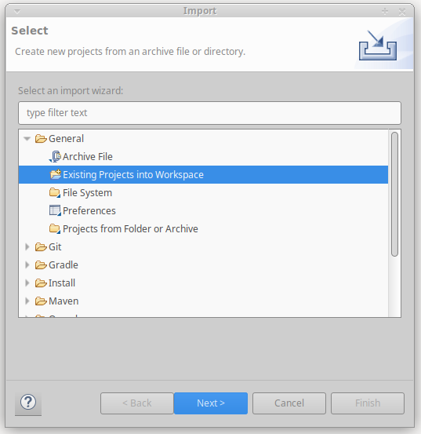
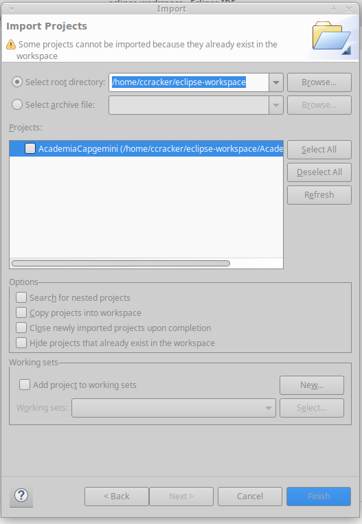
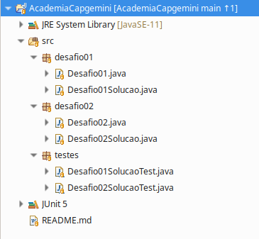
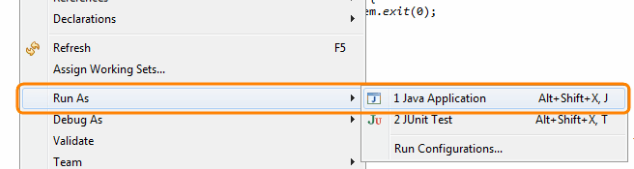
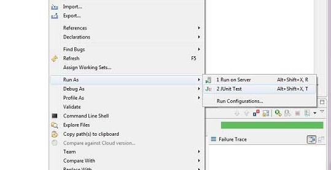
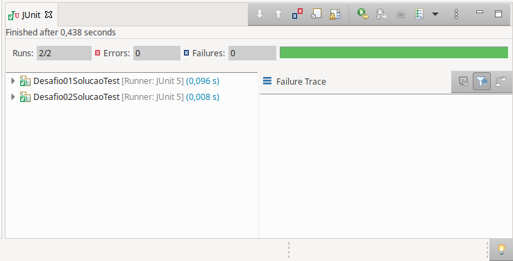

<h1 align="center"></h1>

# Sobre

Neste repositório se encontra as soluções dos problemas de programação propostos pela Capgemini no âmbito da Academia Capgemini.

## Tecnologias ultilizadas

<ul>
    <li>Java SE 11 <strong>(Pode ser baixado <a href="https://www.oracle.com/br/java/technologies/javase/jdk11-archive-downloads.html">Aqui</a>)</strong></li>
    <li>Eclipse IDE for Java Developers - 2021 - 03 <strong>(Pode ser baixado <a href="https://www.eclipse.org/downloads/">Aqui</a>)</strong></li>
    <li>Junit 5 <strong>(Pode ser baixado <a href="https://junit.org/junit5/">Aqui</a>)</strong></li></li>
</ul>

Para informações mais apuradas recomenda-se usar a documentação oficial da ferramenta.

<strong>Observação: A IDE do Eclipse já trás suporte para a ferramenta de testes Junit.</strong>

## Como rodar a aplicação

Clone o repositório dentro da pasta <strong>eclipse-workspace</strong>

`$ git clone https://github.com/DausterBarbosa/AcademiaCapgemini.git`

Abra o Eclipse vá em <strong>File</strong> -> <strong>Import</strong>

Selecione <strong>Existing Projects into Workspace</strong> e clique em <strong>Next</strong>

No próximo painel selecione <strong>Select root directory</strong> clique em <strong>Browse</strong> e procure o diretório do <strong>eclipse-workspace</strong>, no painel <strong>Projects</strong> será listado todos os projetos do <strong>eclipse-workspace</strong>, selecione o projeto desejado e clique em <strong>Finish</strong>, feito isso o projeto será importado para o Eclipse e estará pronto para ser trabalhado.

## Como o projeto está estruturado

O projeto está estruturado da seguinte forma:

Dentro de <strong>src</strong> contém os pacotes com a solução dos desafios em ordem e um pacote contendo os testes unitários dos mesmos, dentro de cada pacote de solução de um desafio contém uma classe com o algoritmo <strong>(EX: Desafio01Solucao.java)</strong> que resolve o problema proposto, e uma classe contendo o método Main <strong>(EX: Desafio01.java)</strong> onde é instanciada a classe com o algoritmo.

## Como executar os desafios

Para executar os desafios clique com o botão direito em cima do arquivo do desafio <strong>(EX: Desafio01.java)</strong> siga até <strong>Run As</strong> e depois clique em <strong>Java Application</strong>.

## Como executar os testes unitários

Para executar os testes basta clicar com o botão direito sobre o arquivo de teste ir até <strong>Run As</strong> e depois clicar em <strong>JUnit Test</strong>, se quiser executar todos os testes clique com o botão direito sobre <strong>Academia Capgemini</strong> e siga os mesmos passos descritos antes.

Se tudo ocorrer como o esperado o painel do Junit não irá acusar nenhum erro nem falha.

